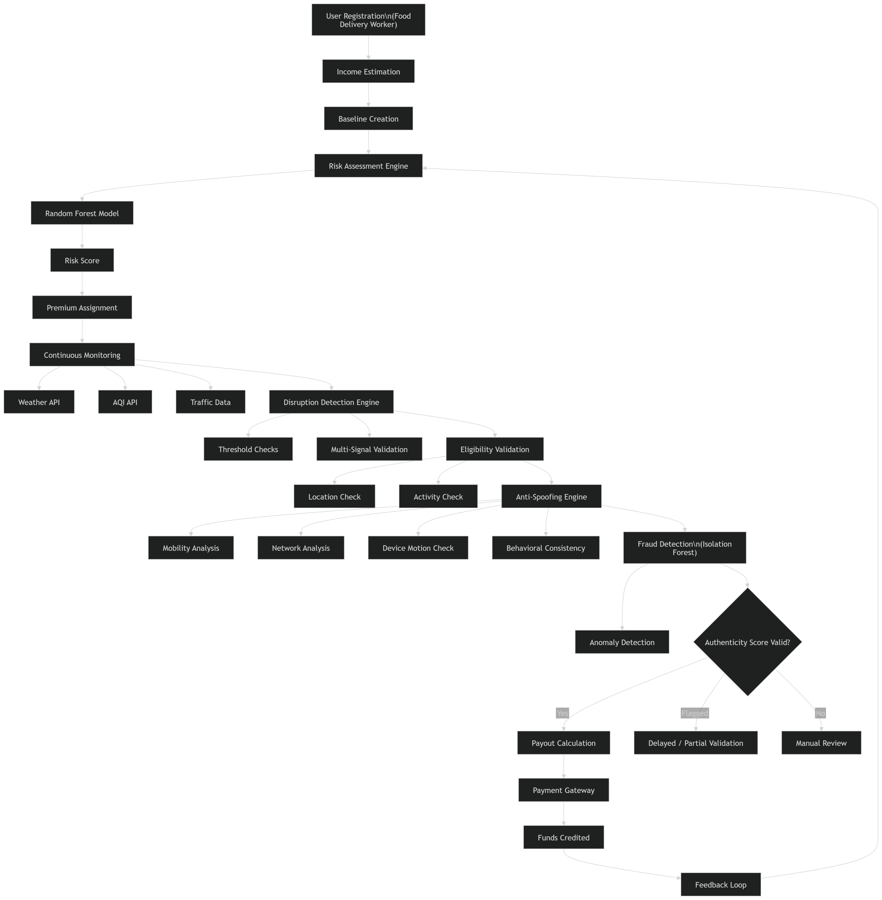

# GigShield AI

### AI-Powered Parametric Income Protection for Gig Workers

---

## 1. Problem Statement

India’s gig economy relies heavily on millions of delivery workers who form the backbone of food delivery services. These workers earn on a daily or weekly basis, making their livelihoods extremely sensitive to external factors. External disruptions such as heavy rainfall, extreme pollution (e.g., severe AQI levels), and unexpected traffic stagnation can significantly reduce their ability to work. When these events occur, they often result in an immediate **20–30% income loss** for the week.

These disruptions share several critical characteristics:

* **Sudden and uncontrollable:** They are force majeure events driven by weather or infrastructure issues.
* **Highly localized:** A disruption might heavily impact one neighborhood while leaving another completely unaffected.
* **Directly tied to working conditions:** Outdoor gig workers have high exposure to environmental risks and cannot simply work from home or indoors.

Despite these harsh realities, existing insurance solutions are designed around traditional indemnity models. They fundamentally **do not cover loss of expected income due to environmental or operational disruptions**, leaving workers financially exposed.

---

## 2. Target Persona

This solution is focused on **Swiggy and Zomato delivery riders operating in flood-prone regions of Mumbai**.

### Key Characteristics:

* **Financial Vulnerability:** Depend on daily income
* **High-Risk Exposure:** Work outdoors in harsh conditions
* **Geographic Reality:** Affected by flooding, congestion, and infrastructure failures

---

## 3. Solution Overview

GigShield AI is a **parametric insurance platform** providing **automated income protection**.

Instead of manual claims:

* **Monitors real-time data** (weather, AQI, traffic)
* **Detects disruptions automatically**
* **Calculates income loss using baseline models**
* **Triggers instant payouts**

### Key Principles:

* Zero friction (no claims)
* Transparent (data-driven)
* Scalable (API-based expansion)
* Fraud-resilient (behavior-aware design)

---

## 4. System Workflow

*The diagram above illustrates the end-to-end automated pipeline logic of GigShield AI. It starts by establishing a worker's income baseline and assigning continuous premiums. During real-time monitoring, if a disruption is detected, the workflow seamlessly moves through an **Eligibility Validation**—checking against localized data—before securely passing through an advanced **Anti-Spoofing & Fraud Detection** layer. Finally, the decision engine routes legitimate claims to an **Instant Payout** gateway while flagging anomalous behavior for delayed or manual review.*

---

## 5. Income Estimation and Baseline Modeling

Baseline = Weekly Income ÷ Working Days

### Features:

* ±20–30% tolerance
* Prevents manipulation
* Ensures fair payouts

---

## 6. Parametric Trigger System

### Environmental Triggers:

* Rainfall > 50 mm/day
* AQI > 300
* Temperature > 40°C

### Multi-Signal Validation:

* Weather + traffic + activity alignment required

---

## 7. Eligibility and Validation

* Location match
* Active during disruption
* Behavioral consistency

---

## 8. Fraud Prevention & Fairness

### Covers:

* Earnings manipulation
* Timing manipulation
* Genuine increased effort

### Model:

* Isolation Forest

---

## 9. AI/ML Components

### Risk Model:

* Random Forest

### Fraud Model:

* Isolation Forest

### Pricing:

Premium = Base × Risk × Season

---

## 10. API Integrations

* Weather API
* AQI API
* Traffic API
* Geolocation API
* Razorpay (test mode)

---

## 11. Technical Architecture

### Frontend:

* React + Tailwind

### Backend:

* FastAPI

### ML:

* scikit-learn

### Database:

* Firebase / PostgreSQL

---

## 12. Approach

* Automated triggers over claims
* Behavior-aware system
* Fairness + fraud balance

---

## 13. Development Plan

### Phase 2:

* Backend + ML + triggers

### Phase 3:

* Fraud + dashboard + payouts

---

## 14. Future Scope

* Multi-city expansion
* Platform integrations
* Advanced analytics

---

## 15. Adversarial Defense & Anti-Spoofing Strategy

GigShield AI is built to handle **coordinated GPS spoofing attacks** using a **multi-signal behavioral verification system**.

### 15.1 Differentiation

Instead of relying on GPS:

* Movement patterns
* Network conditions
* Device motion
* Work activity
* Behavioral history

→ Combined into an **Authenticity Score**

---

### 15.2 Data Beyond GPS

* Accelerometer & motion
* Network stability
* Activity logs
* Environmental correlation
* Historical behavior

---

### 15.3 Fraud Ring Detection

* Detects synchronized claims
* Identifies clustered anomalies
* Prevents mass exploitation

---

### 15.4 UX Balance

Three-tier system:

* High confidence → instant payout
* Medium → delayed validation
* Low → manual review

Includes:

* Grace buffers
* No harsh rejection
* Fair handling of network issues

---

## Key Insight

GigShield AI verifies:

**“Is the user actually experiencing disruption?”**

—not just where they are.

---

## 16. Conclusion

GigShield AI represents a fundamental shift in how insurance can serve the gig economy. By replacing slow, subjective manual claims with instant, data-driven parametric triggers, it builds a safety net that actually aligns with the fast-paced reality of gig work. Crucially, its robust behavioral analysis and anti-spoofing logic ensure that the platform remains financially sustainable, protecting genuine riders while filtering out systemic abuse. Ultimately, GigShield AI doesn't just compensate for lost income—it brings true financial stability to the workers who keep our cities moving. 
